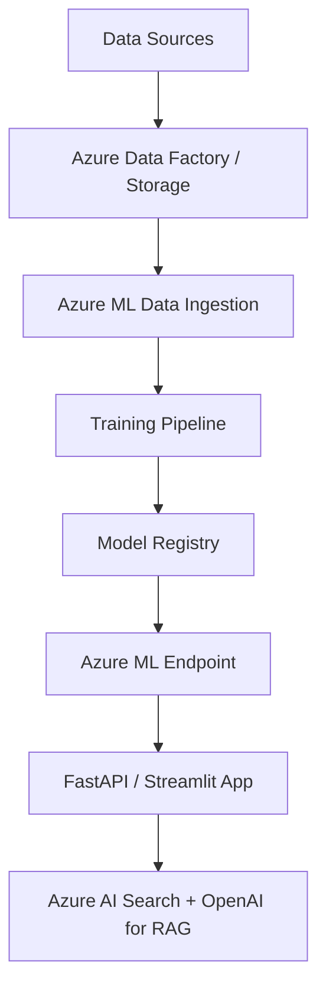

# Azure MLOps Portfolio

> End-to-end MLOps demonstrations using Azure Machine Learning, Azure AI Search, and Retrieval-Augmented Generation (RAG) patterns.  
> Built as part of my transition from embedded/software engineering to AI Engineering.

## About Me 
I hold the following certifications:
- Microsoft Azure AI Fundamentals (AI-900)
- Microsoft Azure AI Engineer Associate (AI-102)
- KT AICE Professional

This portfolio showcases my hands-on learning journey in Azure MLOps and generative AI solutions.

## Projects Overview

| Project | Description | Key Azure Services | Status |
|---------|-------------|--------------------|--------|
| **RAG Demo** ([`rag-demo/azure-rag-cli`](rag-demo/azure-rag-cli)) | End-to-end RAG CLI: PDF → chunk/embed → Azure AI Search → vector Q&A with Azure OpenAI | Azure AI Search, Azure OpenAI | Completed |
| **AI Search Pipeline** | Custom vector search index with semantic ranking | Azure AI Search, Cognitive Services | Planned |
| **MLOps End-to-End** | Full ML lifecycle: data prep → training → registry → deployment → monitoring | Azure Machine Learning, GitHub Actions CI/CD | In Progress |
| **Model Monitoring** | Drift detection and automated retraining demo | Azure ML Monitoring, Pipelines | Planned |

### Recent updates — `rag-demo/azure-rag-cli`

Python CLI for a full Azure RAG pipeline:

1. **create** — Extract text from a PDF, chunk it, and generate embeddings with Azure OpenAI
2. **upload** — Create an Azure AI Search index and upload embedded documents
3. **query** — Run vector search and answer questions with Azure OpenAI chat

See [`rag-demo/azure-rag-cli/README.md`](rag-demo/azure-rag-cli/README.md) for setup, configuration, and usage.

### Recent updates — Azure ML training job

Current hands-on progress:

- Connected to an Azure ML Workspace using Python SDK v2
- Created an `MLClient`
- Created and used an Azure ML Compute Cluster
- Configured a custom Environment
- Successfully executed a Custom Training Job using `command()`
- Verified job execution and artifacts in Azure ML Studio

Next:

- Submit jobs programmatically with `ml_client.jobs.create_or_update()`
- Register trained model
- Build an Azure ML pipeline

## Architecture Overview
(Planned)

