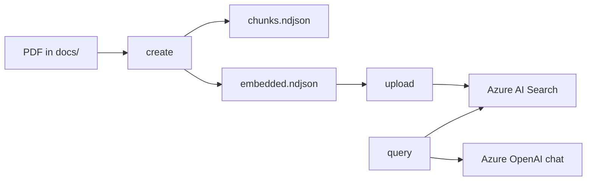

# Azure RAG Portfolio

A small Python CLI for an end-to-end Azure RAG pipeline:

1. Extract text from a PDF, chunk it, and generate embeddings with Azure OpenAI
2. Create an Azure AI Search index and upload embedded documents
3. Run vector search and answer questions with Azure OpenAI chat

## Prerequisites

- Python 3.10+
- An [Azure OpenAI](https://learn.microsoft.com/azure/ai-services/openai/) resource with:
  - An embedding deployment (default: `text-embedding-3-large`, 3072 dimensions)
  - A chat deployment (default: `o4-mini`)
- An [Azure AI Search](https://learn.microsoft.com/azure/search/) service

## Installation

From this project directory (`rag-demo/azure-rag-cli`), create and activate a virtual environment, then install dependencies:

```bash
cd rag-demo/azure-rag-cli
python3 -m venv .venv
source .venv/bin/activate   # Windows: .venv\Scripts\activate
pip install -r requirements.txt
```

After activation, the shell prompt usually shows `(.venv)`, and `python` / `pip` point at the venv.

To leave the venv later:

```bash
deactivate
```

In a new terminal session, `cd` back here and activate again with `source .venv/bin/activate` before running commands.

This project uses a `src/` layout without packaging. Prefix commands with `PYTHONPATH=src` (see Usage).

## Configuration

Copy the example env file and fill in your values:

```bash
cp .env.example .env
```

Never commit `.env`. It is listed in `.gitignore`.

### Required variables

| Variable                    | Description                              |
| --------------------------- | ---------------------------------------- |
| `AZURE_OPENAI_API_KEY`      | Azure OpenAI API key                     |
| `AZURE_OPENAI_API_ENDPOINT` | Azure OpenAI endpoint URL                |
| `AZURE_SEARCH_SERVICE`      | AI Search service name (hostname prefix) |
| `AZURE_SEARCH_ADMIN_KEY`    | AI Search admin API key                  |

### Optional variables

| Variable                            | Default                  | Description                                    |
| ----------------------------------- | ------------------------ | ---------------------------------------------- |
| `AZURE_OPENAI_API_VERSION`          | `2024-12-01-preview`     | Azure OpenAI API version                       |
| `AZURE_OPENAI_EMBEDDING_DEPLOYMENT` | `text-embedding-3-large` | Embedding deployment name                      |
| `AZURE_OPENAI_CHAT_DEPLOYMENT`      | `o4-mini`                | Chat deployment name                           |
| `AZURE_SEARCH_INDEX`                | `idx-docs`               | Search index name                              |
| `AZURE_SEARCH_API_VERSION`          | `2023-11-01`             | AI Search REST API version                     |
| `EMBEDDING_DIMENSIONS`              | `3072`                   | Vector dimensions (must match embedding model) |
| `CHUNK_MAX_LENGTH`                  | `1000`                   | Max characters per text chunk                  |
| `VECTOR_SEARCH_K`                   | `3`                      | Number of chunks to retrieve per query         |

## Sample documents

Place input PDFs under `docs/` (for example `docs/sayno_230405.pdf`). Keep large binaries out of git when possible so the repo stays small; generated NDJSON next to the PDF can also be omitted from version control.

## Usage

Run all commands from `rag-demo/azure-rag-cli` with the venv activated.

### 1. Create NDJSON from a PDF

Extracts text, chunks it, writes plain chunks, then writes chunks with embeddings:

```bash
PYTHONPATH=src python -m azure_rag_portfolio create --pdf docs/sayno_230405.pdf
```

Output files (by default, next to the PDF):

- `docs/sayno_230405_chunks.ndjson`
- `docs/sayno_230405_chunks_with_embedding.ndjson`

Custom paths (then pass the same embeddings file to `upload`):

```bash
PYTHONPATH=src python -m azure_rag_portfolio create \
  --pdf docs/sayno_230405.pdf \
  --chunks output/chunks.ndjson \
  --embeddings output/chunks_with_embedding.ndjson \
  --doc-id sayno_230405

PYTHONPATH=src python -m azure_rag_portfolio upload \
  --ndjson output/chunks_with_embedding.ndjson
```

### 2. Upload to Azure AI Search

Creates the index if it does not exist, then uploads documents. Use the embeddings NDJSON from step 1 (default path shown):

```bash
PYTHONPATH=src python -m azure_rag_portfolio upload \
  --ndjson docs/sayno_230405_chunks_with_embedding.ndjson
```

### 3. Run a RAG query

```bash
PYTHONPATH=src python -m azure_rag_portfolio query "세이노는 누구인가?"
```

Show retrieved chunks before the answer:

```bash
PYTHONPATH=src python -m azure_rag_portfolio query "세이노는 누구인가?" --show-results
```

Retrieve more chunks:

```bash
PYTHONPATH=src python -m azure_rag_portfolio query "세이노는 누구인가?" -k 5
```

### Help

```bash
PYTHONPATH=src python -m azure_rag_portfolio --help
PYTHONPATH=src python -m azure_rag_portfolio create --help
PYTHONPATH=src python -m azure_rag_portfolio upload --help
PYTHONPATH=src python -m azure_rag_portfolio query --help
```

## Project layout

```
rag-demo/azure-rag-cli/
  .env.example
  README.md
  requirements.txt
  docs/                          # Place sample PDFs here (keep large files out of git)
  src/
    azure_rag_portfolio/
      cli.py                     # Command-line entry point
      settings.py                # Environment and .env loading
      create_ndjson.py           # PDF extraction, chunking, embedding
      upload.py                  # Index creation and document upload
      rag.py                     # Vector search and chat completion
      __main__.py                # Enables: python -m azure_rag_portfolio
```

## Pipeline overview



## Cleanup

Delete the Azure AI Search resource when you are done experimenting to avoid ongoing costs.

## Troubleshooting

**Module not found: `azure_rag_portfolio`**

Run from `rag-demo/azure-rag-cli` and include `PYTHONPATH=src` on the command, as shown above.

**Missing environment variable**

Set the required variables in `.env` or export them in your shell. The error message names the missing variable.

**Chat deployment not found**

Set `AZURE_OPENAI_CHAT_DEPLOYMENT` to the exact deployment name in your Azure OpenAI resource (not necessarily the underlying model name).

**Embedding dimension mismatch**

Ensure `EMBEDDING_DIMENSIONS` matches your embedding model. `text-embedding-3-large` uses `3072`.
